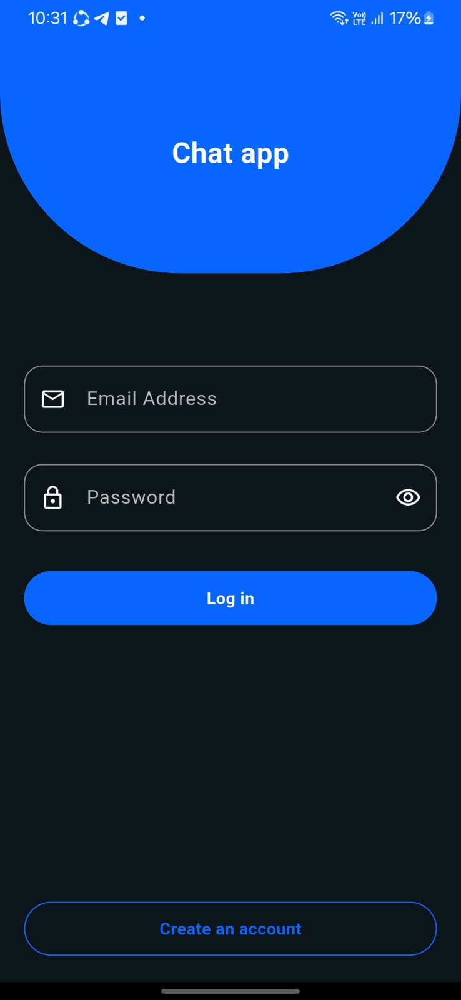
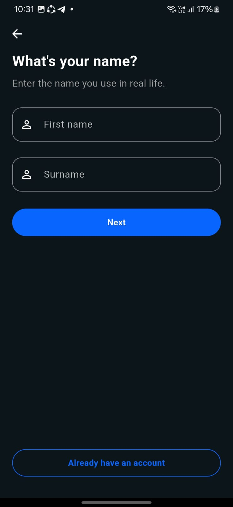
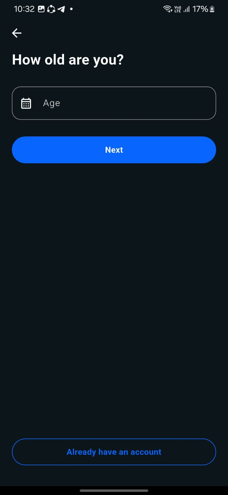
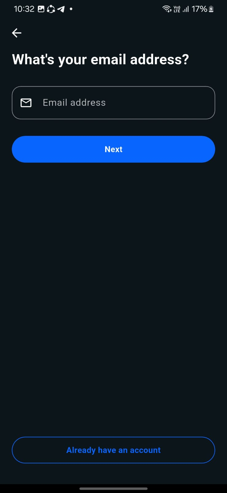
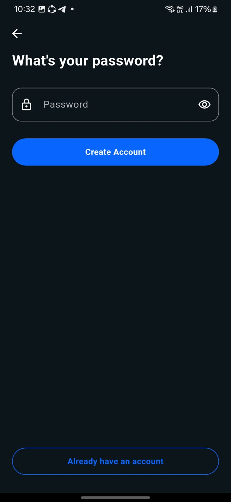
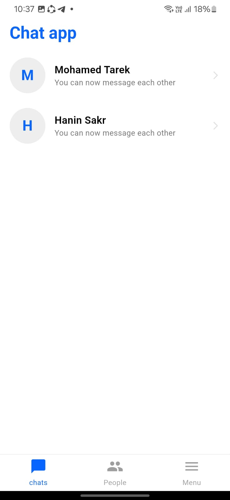
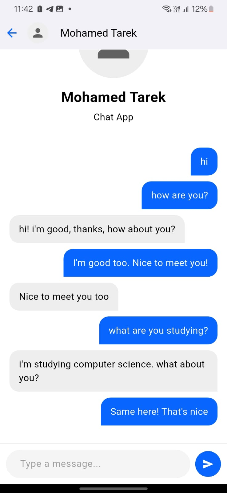
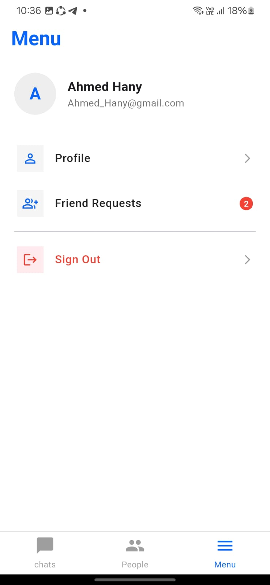
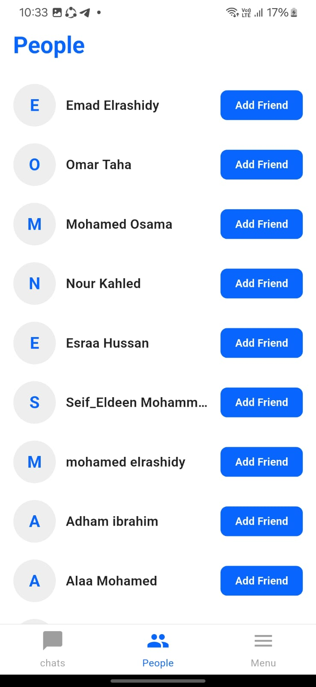
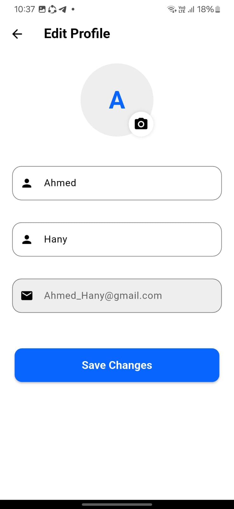

# 💬 Chat App

Chat App is a cross-platform messaging app built with Flutter and Firebase. It lets users sign up, add friends, and chat privately — only with people on their friends list, not with the entire user base.

The app runs on Android, iOS, Web, Windows, macOS, and Linux from a single codebase.

## ✨ Features

- **Authentication** — sign up, log in, and log out via Firebase Auth
- **Friends system** — send/add friend requests and remove friends from your list
- **Private chat** — chat only with users you've added as friends
- **Profile editing** — update your profile information (no profile picture support yet)

## 📱 Screenshots

| Login | Name | Age | Email |
| :---: | :---: | :---: | :---: |
|  |  |  |  |

| Password | Home | Chat | Menu |
| :---: | :---: | :---: | :---: |
|  |  |  |  |

| People | Requests | Profile |
| :---: | :---: | :---: |
|  |  |  |

## ⚙️ Technical Highlights

- **State management:** built with Flutter's built-in `setState` — no external state management package
- **Backend:** Firebase (Authentication, Cloud Firestore) for user data, friend relationships, and real-time messaging
- **Cross-platform:** single Flutter codebase targeting mobile, web, and desktop

## 🧰 Tech Stack

| Layer | Technology |
|---|---|
| Framework | Flutter (Dart) |
| State Management | setState |
| Backend / Database | Firebase Cloud Firestore |
| Authentication | Firebase Auth |

## 📁 Project Structure

```
lib/
├── models/          # Data models (User, Message, Friend)
├── pages/           # UI screens (login, chat list, chat, profile)
├── widgets/         # Reusable UI components
├── constants.dart   # App-wide constants
└── main.dart        # App entry point
